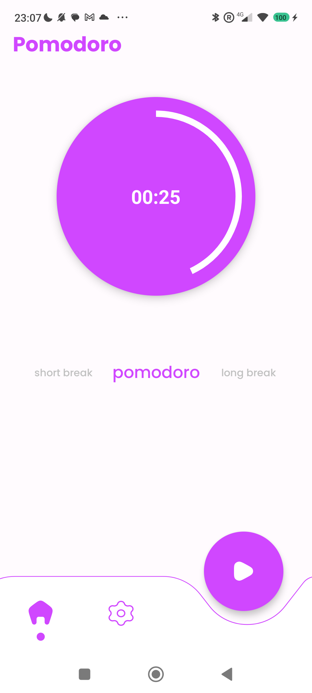
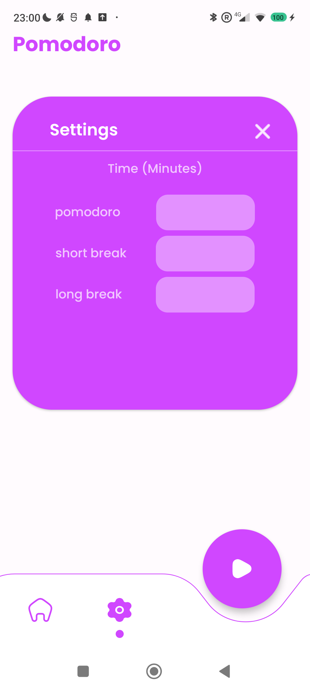

# Pomodoro app

<table>
  <tr>
    <td>
      
    </td>
    <td>
      
    </td>
  </tr>
</table>

## About the App

The Pomodoro App is a time management tool designed to help you enhance your productivity and focus. It utilizes the Pomodoro technique, a time management method developed to break work into intervals of intense focus interspersed with short rest breaks.

## Technologies Used

The app is developed using the following technologies:

- Kotlin: The primary programming language.
- XML: Used to create the user interface.
- Android Studio: The development IDE for Android.

## Purpose

This app was created for educational purposes and as a learning project to explore and practice Android app development.

## Features

- Pomodoro timer configuration.

# Credits

The layout used is based on the design available at this [Figma link](https://www.figma.com/community/file/1071705448341103976), originally created by [Hari Haran](https://www.figma.com/@hariharan07).

---
